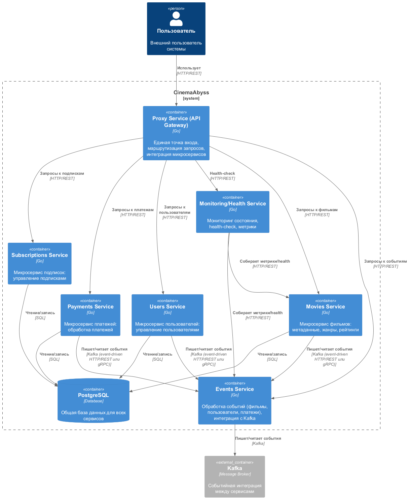
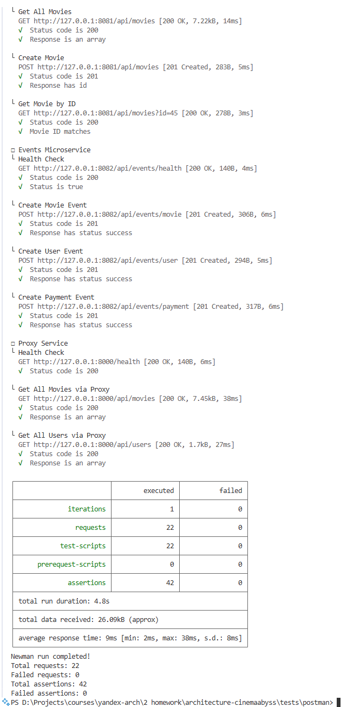
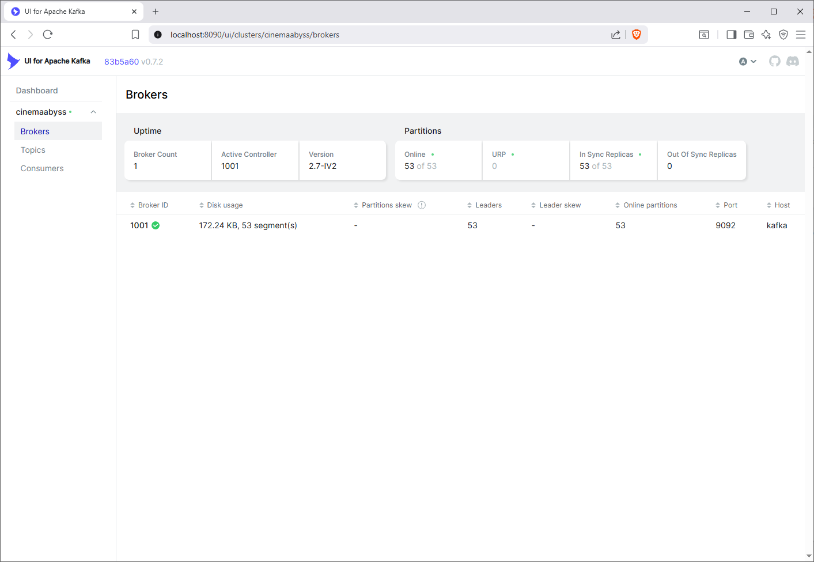
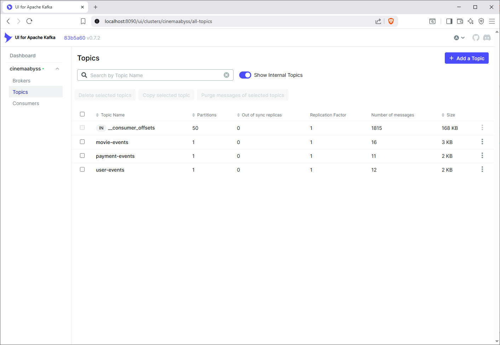
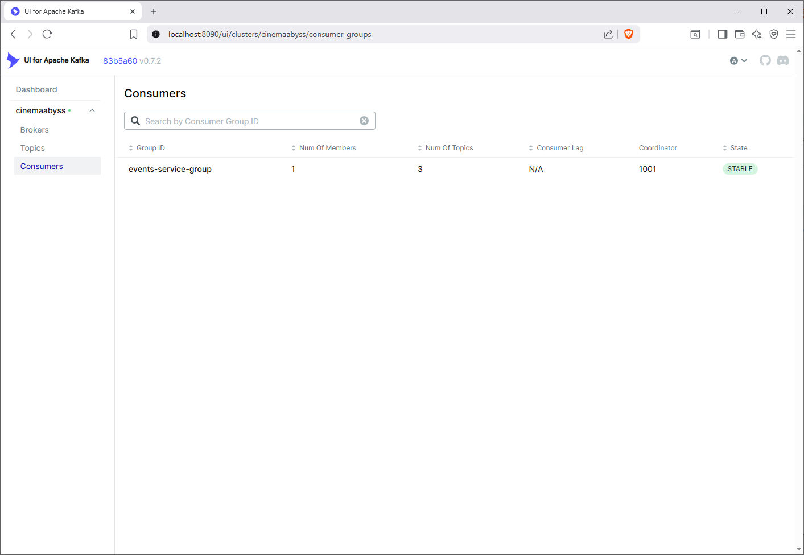

## Изучите [README.md](.\README.md) файл и структуру проекта.

# Задание 1

1. Спроектируйте to be архитектуру КиноБездны, разделив всю систему на отдельные домены и организовав интеграционное взаимодействие и единую точку вызова сервисов.
Результат представьте в виде контейнерной диаграммы в нотации С4.
Добавьте ссылку на файл в этот шаблон

[./diagrams/container/cinemaabyss_to-be.puml](./diagrams/container/cinemaabyss_to-be.puml)



# Задание 2

### 1. Proxy
Команда КиноБездны уже выделила сервис метаданных о фильмах movies и вам необходимо реализовать бесшовный переход с применением паттерна Strangler Fig в части реализации прокси-сервиса (API Gateway), с помощью которого можно будет постепенно переключать траффик, используя фиче-флаг.


Реализуйте сервис на любом языке программирования в ./src/microservices/proxy.
Конфигурация для запуска сервиса через docker-compose уже добавлена
```yaml
  proxy-service:
    build:
      context: ./src/microservices/proxy
      dockerfile: Dockerfile
    container_name: cinemaabyss-proxy-service
    depends_on:
      - monolith
      - movies-service
      - events-service
    ports:
      - "8000:8000"
    environment:
      PORT: 8000
      MONOLITH_URL: http://monolith:8080
      #монолит
      MOVIES_SERVICE_URL: http://movies-service:8081 #сервис movies
      EVENTS_SERVICE_URL: http://events-service:8082 
      GRADUAL_MIGRATION: "true" # вкл/выкл простого фиче-флага
      MOVIES_MIGRATION_PERCENT: "50" # процент миграции
    networks:
      - cinemaabyss-network
```

- После реализации запустите postman тесты - они все должны быть зеленые (кроме events).
- Отправьте запросы к API Gateway:
   ```bash
   curl http://localhost:8000/api/movies
   ```
- Протестируйте постепенный переход, изменив переменную окружения MOVIES_MIGRATION_PERCENT в файле docker-compose.yml.


### 2. Kafka
 Вам как архитектуру нужно также проверить гипотезу насколько просто реализовать применение Kafka в данной архитектуре.

Для этого нужно сделать MVP сервис events, который будет при вызове API создавать и сам же читать сообщения в топике Kafka.

    - Разработайте сервис на любом языке программирования с consumer'ами и producer'ами.
    - Реализуйте простой API, при вызове которого будут создаваться события User/Payment/Movie и обрабатываться внутри сервиса с записью в лог
    - Добавьте в docker-compose новый сервис, kafka там уже есть

Необходимые тесты для проверки этого API вызываются при запуске npm run test:local из папки tests/postman 
Приложите скриншот тестов и скриншот состояния топиков Kafka из UI http://localhost:8090 

**Результаты тестов**
- [tests/postman/reports/junit-report-local-2025-08-17T17-26-35.990Z.xml](tests/postman/reports/junit-report-local-2025-08-17T17-26-35.990Z.xml)
- [tests/postman/reports/report-local-2025-08-17T17-26-35.990Z.html](tests/postman/reports/report-local-2025-08-17T17-26-35.990Z.html)
- [tests/postman/reports/cinemaabyss-events-service.log](tests/postman/reports/cinemaabyss-events-service.log)

**Newman (console)**
- 

**Postman**
- 

**Kafka UI**
- _Brokers_  

- _Topics_  



- _Consumers_  


# Задание 3

Команда начала переезд в Kubernetes для лучшего масштабирования и повышения надежности. 
Вам, как архитектору осталось самое сложное:
 - реализовать CI/CD для сборки прокси сервиса
 - реализовать необходимые конфигурационные файлы для переключения трафика.


### CI/CD

 В папке .github/worflows доработайте деплой новых сервисов proxy и events в docker-build-push.yml , чтобы api-tests при сборке отрабатывали корректно при отправке коммита в ваш репозиторий.

Нужно доработать 
```yaml
on:
  push:
    branches: [ main ]
    paths:
      - 'src/**'
      - '.github/workflows/docker-build-push.yml'
  release:
    types: [published]
```
и добавить необходимые шаги в блок
```yaml
jobs:
  build-and-push:
    runs-on: ubuntu-latest
    permissions:
      contents: read
      packages: write

    steps:
      - name: Checkout repository
        uses: actions/checkout@v3

      - name: Set up Docker Buildx
        uses: docker/setup-buildx-action@v2

      - name: Log in to the Container registry
        uses: docker/login-action@v2
        with:
          registry: ${{ env.REGISTRY }}
          username: ${{ github.actor }}
          password: ${{ secrets.GITHUB_TOKEN }}

```
Как только сборка отработает и в github registry появятся ваши образы, можно переходить к блоку настройки Kubernetes
Успешным результатом данного шага является "зеленая" сборка и "зеленые" тесты

- **GitHub Actions**  


### Proxy в Kubernetes

#### Шаг 1
Для деплоя в kubernetes необходимо залогиниться в docker registry Github'а.
1. Создайте Personal Access Token (PAT) https://github.com/settings/tokens . Создавайте class с правом read:packages

> **Комментарий**
> 
> Сейчас это назвается персональный токен (классический) (_New personal access token (classic)_)  
> И выбрать нужно scope (_Select scopes: read:packages_)  

2. В src/kubernetes/*.yaml (event-service, monolith, movies-service и proxy-service)  отредактируйте путь до ваших образов 
```bash
 spec:
      containers:
      - name: events-service
        image: ghcr.io/ваш логин/имя репозитория/events-service:latest
```

> **Комментарий**
> 
> В пути к образам `image` весь URL должен быть lower case, иначе Kubernetes не сможет его найти и загрузить

3. Добавьте в секрет src/kubernetes/dockerconfigsecret.yaml в поле
```bash
 .dockerconfigjson: значение в base64 файла ~/.docker/config.json
```

4. Если в ~/.docker/config.json нет значения для аутентификации
```json
{
        "auths": {
                "ghcr.io": {
                       тут пусто
                }
        }
}
```
то выполните 

и добавьте

```json 
 "auth": "имя пользователя:токен в base64"
```

Чтобы получить значение в base64 можно выполнить команду
```bash
 echo -n ваш_логин:ваш_токен | base64
```

> **Комментарий**
> 
> В Windows PowerShell нет встроенной команды base64, как в Linux/macOS.  
> Вместо этого нужно использовать PowerShell-команду для кодирования в base64:  
> `[Convert]::ToBase64String([Text.Encoding]::UTF8.GetBytes("логин:токен"))`

После заполнения config.json, также прогоните содержимое через base64

```bash
cat .docker/config.json | base64
```

> **Комментарий**
> 
> [Convert]::ToBase64String([IO.File]::ReadAllBytes("$env:USERPROFILE\.docker\config.json"))

и полученное значение добавляем в

```bash
 .dockerconfigjson: значение в base64 файла ~/.docker/config.json
```

#### Шаг 2

  Доработайте src/kubernetes/event-service.yaml и src/kubernetes/proxy-service.yaml

  - Необходимо создать Deployment и Service 
  - Доработайте ingress.yaml, чтобы можно было с помощью тестов проверить создание событий
  - Выполните дальшейшие шаги для поднятия кластера:

  1. Создайте namespace:
  ```bash
  kubectl apply -f src/kubernetes/namespace.yaml
  ```
  2. Создайте секреты и переменные
  ```bash
  kubectl apply -f src/kubernetes/configmap.yaml
  kubectl apply -f src/kubernetes/secret.yaml
  kubectl apply -f src/kubernetes/dockerconfigsecret.yaml
  kubectl apply -f src/kubernetes/postgres-init-configmap.yaml
  ```

  3. Разверните базу данных:
  ```bash
  kubectl apply -f src/kubernetes/postgres.yaml
  ```

  На этом этапе если вызвать команду
  ```bash
  kubectl -n cinemaabyss get pod
  ```
  Вы увидите

  NAME         READY   STATUS    
  postgres-0   1/1     Running   

  4. Разверните Kafka:
  ```bash
  kubectl apply -f src/kubernetes/kafka/kafka.yaml
  ```

  Проверьте, теперь должно быть запущено 3 пода, если что-то не так, то посмотрите логи
  ```bash
  kubectl -n cinemaabyss logs имя_пода (например - kafka-0)
  ```

  5. Разверните монолит:
  ```bash
  kubectl apply -f src/kubernetes/monolith.yaml
  ```
  6. Разверните микросервисы:
  ```bash
  kubectl apply -f src/kubernetes/movies-service.yaml
  kubectl apply -f src/kubernetes/events-service.yaml
  ```
  7. Разверните прокси-сервис:
  ```bash
  kubectl apply -f src/kubernetes/proxy-service.yaml
  ```

  После запуска и поднятия подов вывод команды 
  ```bash
  kubectl -n cinemaabyss get pod
  ```

  Будет наподобие такого

```bash
  NAME                              READY   STATUS    

  events-service-7587c6dfd5-6whzx   1/1     Running  

  kafka-0                           1/1     Running   

  monolith-8476598495-wmtmw         1/1     Running  

  movies-service-6d5697c584-4qfqs   1/1     Running  

  postgres-0                        1/1     Running  

  proxy-service-577d6c549b-6qfcv    1/1     Running  

  zookeeper-0                       1/1     Running 
```

  8. Добавим ingress

  - добавьте аддон
  ```bash
  minikube addons enable ingress
  ```
  ```bash
  kubectl apply -f src/kubernetes/ingress.yaml
  ```
  9. Добавьте в /etc/hosts
  127.0.0.1 cinemaabyss.example.com

  10. Вызовите
  ```bash
  minikube tunnel
  ```
  11. Вызовите https://cinemaabyss.example.com/api/movies
  Вы должны увидеть вывод списка фильмов

> 

  Можно поэкспериментировать со значением   MOVIES_MIGRATION_PERCENT в src/kubernetes/configmap.yaml и убедится, что вызовы movies уходят полностью в новый сервис

> **Комментарий**
> 
> Значения в `src/kubernetes/configmap.yaml` не применяются, т.к. переменная с таким же именем указана в src/kubernetes/proxy-service.yaml:
> ```yaml
>         env:
>         # ...
>         - name: MOVIES_MIGRATION_PERCENT
>          value: "50"
>         envFrom:
>         - configMapRef:
>             name: cinemaabyss-config
> ```
> Приоритет `env` выше, чем у секции `envFrom`, в которой подключаются переменные `configmap.yaml`, поэтому события в логи сервисов `deployment/monolith` и `deployment/movies-service` пишут примерно с одинаковой частотой, игнорируя значение в `src/kubernetes/configmap.yaml`. Для того, чтобы переменная вступила в силу, нужно удалить/закомментировать значение `MOVIES_MIGRATION_PERCENT` в секции `env`.
> - configmap.yaml: `MOVIES_MIGRATION_PERCENT: "100"`
> 
> - configmap.yaml: `MOVIES_MIGRATION_PERCENT: "0"`  
>   ```bash
>   kubectl apply -f .\src\kubernetes\configmap.yaml
>   kubectl -n cinemaabyss rollout restart deployment/monolith
>   kubectl rollout restart deployment/proxy-service -n cinemaabyss
>   kubectl rollout restart deployment/movies-service -n cinemaabyss
>   ```
>   

  12. Запустите тесты из папки tests/postman
  ```bash
   npm run test:kubernetes
  ```
  Часть тестов с health-чек упадет, но создание событий отработает.
  Откройте логи event-service и сделайте скриншот обработки событий

**Результаты тестов**

+ [report-local-2025-08-21T23-27-49.964Z (Ingress, 5).log](<tests/postman/reports/report-local-2025-08-21T23-27-49.964Z (Ingress, 5).log>)
+ 

> **Комментарий**
> 
> Основной сложностью было решение проблемы с прогоном тестов – падали все ассерты.
> 
> После разбирательств оказалось, что `minikube` не смог занять 80-й порт (работал только HTTPS/443), поэтому все ассерты в тестах падали. После нахождения первопричины, остановки локального IIS проблемой стало перестроение сервисов _Kafka_ и _Zookeeper_ - после перезапуска `minikube` (`minikube stop`/`minikube start` для захвата Ingress'ом 80-го порта) оба сервиса свалились в `CrashLoopBackOff` и ничего не помогало. Удаление PVC/PV падало с таймаутом контекста операции (возможно наложение проблемы с подвисшим терминалом `minikube ssh`), удаление метаданных через `minikube ssh` тоже не спасало - все операции удаления оканчивались без результата.
> 
> Проблему “получилось решить” только полной очисткой кластера через `minikube delete`. Но т.к. манифесты были уже настроены, новый кластер поднялся уже очень быстро.

#### Шаг 3
Добавьте сюда скриншоты вывода при вызове https://cinemaabyss.example.com/api/movies и  скриншот вывода event-service после вызова тестов.

> + 
> + [events-service.log](<tests/postman/reports/report-local-2025-08-21T23-41-27.964Z (Ingress, 7).log>)
> + 

# Задание 4
Для простоты дальнейшего обновления и развертывания вам как архитектуру необходимо так же реализовать helm-чарты для прокси-сервиса и проверить работу 

Для этого:
1. Перейдите в директорию helm и отредактируйте файл values.yaml

```yaml
# Proxy service configuration
proxyService:
  enabled: true
  image:
    repository: ghcr.io/db-exp/cinemaabysstest/proxy-service
    tag: latest
    pullPolicy: Always
  replicas: 1
  resources:
    limits:
      cpu: 300m
      memory: 256Mi
    requests:
      cpu: 100m
      memory: 128Mi
  service:
    port: 80
    targetPort: 8000
    type: ClusterIP
```

- Вместо ghcr.io/db-exp/cinemaabysstest/proxy-service напишите свой путь до образа для всех сервисов
- для imagePullSecret проставьте свое значение (скопируйте из конфигурации kubernetes)
  ```yaml
  imagePullSecrets:
      dockerconfigjson: ewoJImF1dGhzIjogewoJCSJnaGNyLmlvIjogewoJCQkiYXV0aCI6ICJaR0l0Wlhod09tZG9jRjl2UTJocVZIa3dhMWhKVDIxWmFVZHJOV2hRUW10aFVXbFZSbTVaTjJRMFNYUjRZMWM9IgoJCX0KCX0sCgkiY3JlZHNTdG9yZSI6ICJkZXNrdG9wIiwKCSJjdXJyZW50Q29udGV4dCI6ICJkZXNrdG9wLWxpbnV4IiwKCSJwbHVnaW5zIjogewoJCSIteC1jbGktaGludHMiOiB7CgkJCSJlbmFibGVkIjogInRydWUiCgkJfQoJfSwKCSJmZWF0dXJlcyI6IHsKCQkiaG9va3MiOiAidHJ1ZSIKCX0KfQ==
  ```

2. В папке ./templates/services заполните шаблоны для proxy-service.yaml и events-service.yaml (опирайтесь на свою kubernetes конфигурацию - смысл helm'а сделать шаблоны для быстрого обновления и установки)

```yaml
template:
    metadata:
      labels:
        app: proxy-service
    spec:
      containers:
       Тут ваша конфигурация
```

3. Проверьте установку
Сначала удалим установку руками

```bash
kubectl delete all --all -n cinemaabyss
kubectl delete  namespace cinemaabyss
```
Запустите 
```bash
helm install cinemaabyss .\src\kubernetes\helm --namespace cinemaabyss --create-namespace
```
Если в процессе будет ошибка
```code
[2025-04-08 21:43:38,780] ERROR Fatal error during KafkaServer startup. Prepare to shutdown (kafka.server.KafkaServer)
kafka.common.InconsistentClusterIdException: The Cluster ID OkOjGPrdRimp8nkFohYkCw doesn't match stored clusterId Some(sbkcoiSiQV2h_mQpwy05zQ) in meta.properties. The broker is trying to join the wrong cluster. Configured zookeeper.connect may be wrong.
```

Проверьте развертывание:
```bash
kubectl get pods -n cinemaabyss
minikube tunnel
```

Потом вызовите 
https://cinemaabyss.example.com/api/movies
и приложите скриншот развертывания helm и вывода https://cinemaabyss.example.com/api/movies

## Удаляем все

```bash
kubectl delete all --all -n cinemaabyss
kubectl delete namespace cinemaabyss
```
